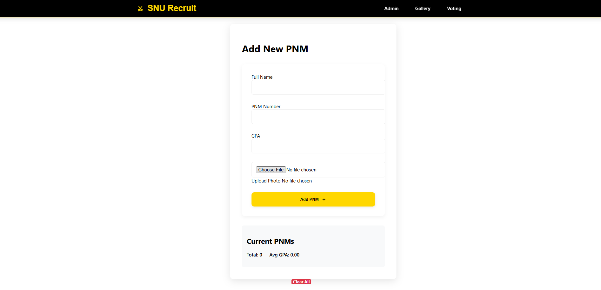
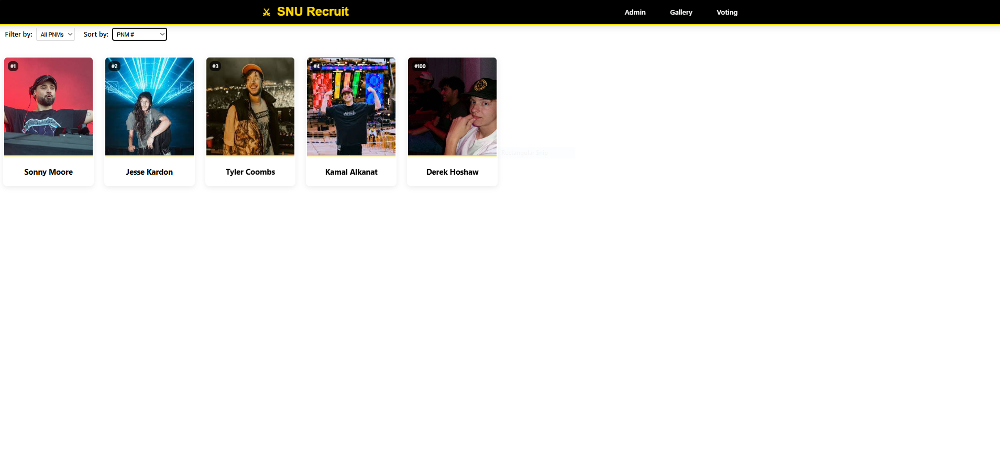
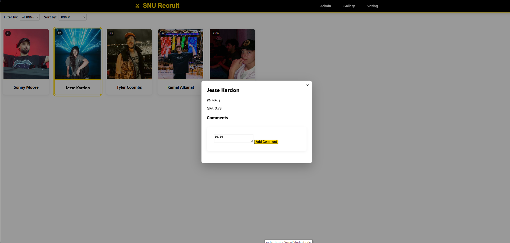
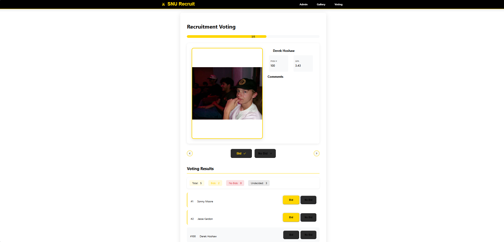

# SNU-Recruit

## Project Purpose
Provide a centralized service for managing and communicating during recruitment

## Demo

- Add Potential New Members (PNM's) to the database by entering information on the form from the Admin page

- For example, adding myself to the roster by entering my information.
- Note, their is a continuous tracker for the number of PNM's and their average GPA

- Once you have added the PNM's into the database, you can view them on the Gallery Page
- Note, you can filter by PNM's with/without bids
- Note, you can sort PNM cards by their first name, last name, or PNM number

- Select any PNM on the Gallery page to open their description
- View their PNM #, GPA, and any comments that have been added to their page (Hometown, interests, etc)
- Add a comment by typing in the textbox and pressing 'Comment'

- Set a status of 'Bid' or 'No Bid' through the voting page.
- Navigate through each PNM with the arrows and selected the option of bid or no bid
- Below, their are simple tracking numbers to view the status of the whole group, and further individual results
